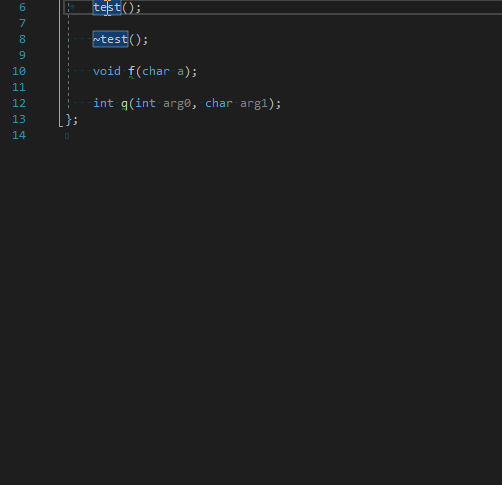

# Doxygen Documenter #
Last updated: 11/08/2018

This is a VS extension that allows creating Doxygen templates automatically above a function definition.
Currently it:
* Makes templates for documenting functions based on their signature
* Makes an entry for each function parameter
* Guess prefered indenting style based on content of the line before the function definition
* Tell destructors and constructors apart from functions

## Features still needing implementation ##
* Use editors' line seperator instead of LF. Guess based on current line seperator
* Think of a way of implementing an option for generating `@throws` blocks for languages with exceptions (Will probably need to do language analysis because VS SDK doesn't export it by itself)
* Make it so the cursor can be anywhere in the line for it to work. Currently only works if the cursor is anywhere between the first keyword and the parameter list start
* Make documentation style configurable
* Just make everything configurable

## Assumptions ##
You are not a horrible programmer and you place symbols on different lines.

## Notes ##
The extension was only tested with VS 2017 Community for C++
It should work for other editions of VS. I have no idea if it will work for other languages.

I also don't know C# so the majority of my code is based on examples from the VS SDK documentation, which is for VB acript so that's useless.
The other part of my code is based on examples from various esoteric sites I have found with examples of using the VS SDK or trial and error.

So basically all of my C# code is bad and poorly designed.

## Contribution ##
You would like to implement one of the above mentiond things or test them ?
Submit a PR and I will look into it when I have time.